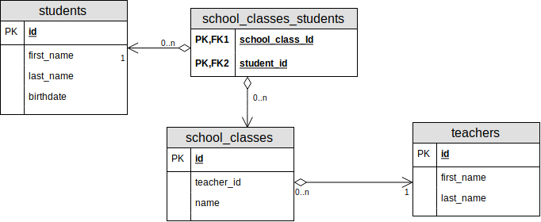

# Przygotowania

1. Sklonuj ten projekt.
2. Skonfiguruj [połączenie](/Datasource.md) z bazą danych.
3. Otwórz plik `create_database.sql` znajdujący się w katalogu `src/main/resources/db`.
   Następnie klikając prawym klawiszem myszki otwórz menu kontekstowe i wybierz opcję
   `Run 'create_database.sql'...`, a potem wybierz skonfigurowany datasource i naciśnij `ok`.
   Po chwili powienieneś zobaczyć komunikat podobny do `Summary: X of Y statements executed in Z ms`.
4. Otwórz plik `DatabaseSetupTest` znajdujący się w katalogu `src/text/java/connection`.
   Następnie klikając prawym klawiszem myszki otwórz menu kontekstowe i wybierz opcję
   `Run 'DatabaseSetupTest'`. Test powinien zakończyć się powodzeniem.
   
# Struktura tabeli



# Dane

Początkowe dane w tabeli `students`:

id | first_name | last_name    | birthdate
---|------------|--------------|-----------
1  | Szymon     | Kowalski     | 1999-02-03
2  | Krystian   | Nowak        | 1999-02-03
3  | Krystyna   | Kowal        | 1996-03-11
4  | Błażej     | Rudnicki     | 1998-12-03

<br/>

Początkowe dane w tabeli `teachers`:

id | first_name | last_name
---|------------|--------------
1  | Damian     | Lewandowski
2  | Artur      | Woźniak
3  | Artur   |    Wójcik

<br/>

Początkowe dane w tabeli `school_class`:

id | teacher_id | name
---|------------|--------------
1  | 1          | Matematyka
2  | 2          | Fizyka
3  | 3          | Chemia


Początkowe dane w tabeli `school_class_student`:

school_class_id | student_id
----------------|--------------
1               | 1
2               | 1
2               | 2
3               | 3
4               | 4


# Wskazówki i zasady

* Nie zmieniaj sygnatur metod. Nie zmieniaj klas innych niż w głównym pakiecie. Nie zmieniaj testów.

* Podczas implementacji metod dodających, uaktulniających albo kasujących dane sprawdź ile wierszy zostało zmienionych.
   Jeżeli ich ilość będzie inna niż oczekiwana, to zgłoś wyjątek.

* Pamiętaj, żeby używać `try-with-resources`!

* Wyjątek `SQLException` możesz obsłużyć poprzez przekazanie go do `RepositoryException`:

  ```java
  catch (SQLException exception) {
     throw new RepositoryException(exception);
  }
   ```

# Zadania

1. Zaimplementuj metody w `StudentsJDBCReposity` tak by przechodziły testy w `StudentsJDBCReposityTest`:

   * Zaimplementuj `findAllStudents` tak by zwracała listę wszystkich studentów.

   * Zaimplementuj `countStudents` tak by zwracała liczbę studentów.

   * Zaimplementuj `findStudentById` tak, by zwracało pusty `Optional` jeżeli student o danym **id** nie zostanie znaleziony.
  
   * Zaimplementuj metodę  `createStudent`, która będzie dodawać wiersz w bazie danych.
     Pole `Id` przekazanego obiektu zawiera null. Metodę należy zaimplementować w ten sposób żeby uzyskać klucz główny z bazy.
     Możesz do tego użyć metody `statement.getGeneratedKeys()`. Przekaż `Statement.RETURN_GENERATED_KEYS` jako trzeci parametr w `createStatement`.
     Możesz wykonać akcje dodania wiersza i uzyskania klucza w obrębie jednej transakcji.

   * Zaimplementuj metodę `updateStudent`, która uaktulnia wiersz w bazie odpowiadający danemu obiektowi.
     Sprawdź czy zapytanie rzeczywiście zmieniło jeden wiersz. Jeżeli nie to przerwij transakcję i rzuć wyjątek.

   * Zaimplementuj metodę `deleteStudent`, która usunie studenta uzywając id. Jeżeli zostanie usuniętych więcej studentów niż 1,
     to wycofaj transakcję.

   * Zaimplementuj metodę `findStudentsByName` pozwalającą wyszukać studentów po począku imienia lub nazwiska.

   * Zaimplementuj metodę `findStudentsByTeacherId` pozwalającą znaleźć studentów po `id` uczącego ich nauczyciela.

   * Zaimplementuj `getAverageAge` zwracającą obliczony średni wiek studentów w momencie daty podanej w parametrze.
   
   * Stwórz procedurę, która anonimizuje dane wszystkich uczniów zastępująć nazwiska, wten sposób,
     że pozostawia tylko pierwszą literę nazwiska oraz dodaje po niej kropkę. Metoda powinna przyjąć listę id wierszy,
     które powinny zostać w ten sposób przetworzone. Wywołaj tą procedurę poprzez JDBC. Kod procedury zapisz
     w pliku `src/main/resources/db/anomize.sql`.

2. Zaimplementuj metody w `TeachersJDBCRepository` tak by przychodziła testy w `TeachersJDBCRepositoryTest` używając `JdbcTemplate`.

   * Zaimplementuj `findTeacherById` wzracający obiekt `Teacher` po `id.

   * Zaimplementuj `findAllTeacher` zwracający wszystkich nauczycieli.

   * Zaimplementuj metodę `findTeachersWhere` wyszukującą nauczycieli po imienu lub nazwisku lub nazwie prowadzonego przez niego przedmiotu.
   Wyszukiwanie powinno być *case-insensitive*, czyli wielkość znaków nie powinna mieć znaczenia.

   * Zaimplementuj metodę `createTeacher`, pozwalającą na dodanie nowego nauczyciela.

   * Zaimplementuj metodę `batchCreateTeachers`, pozwalającą na zbiorcze dodanie nowych nauczycieli.


 
